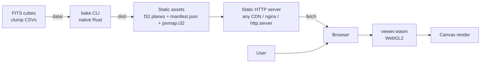
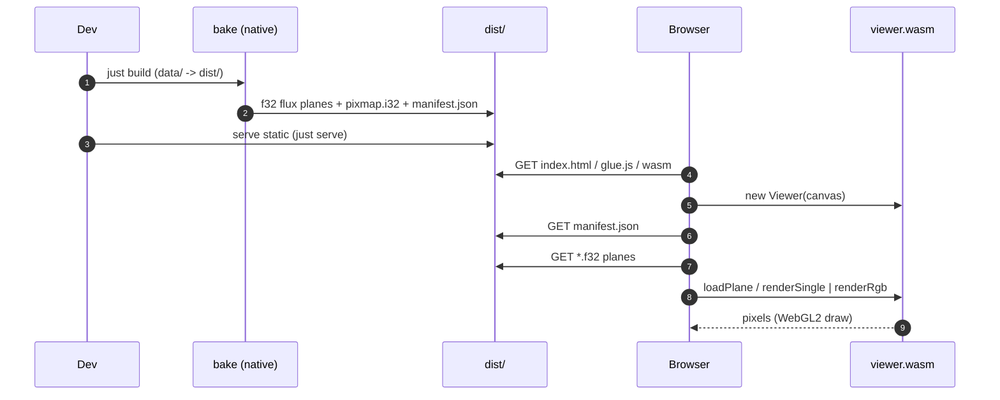

# Overview

Static site. Zero runtime server. Astronomy math shared f64 between native bake and WASM viewer.

## System context

## Top-level flow

## Key properties

- Raw f64 math never shipped: f32 planes shipped, viewer widens to f64.
- Astronomy math (stretch, composite) in `jelly-core`; same code in bake + viewer.
- Pan/zoom = matrix uniform. No data re-fetch while navigating.
- Click → pixmap lookup → clump id.
