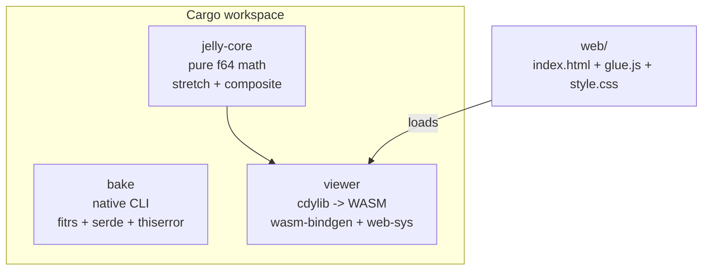
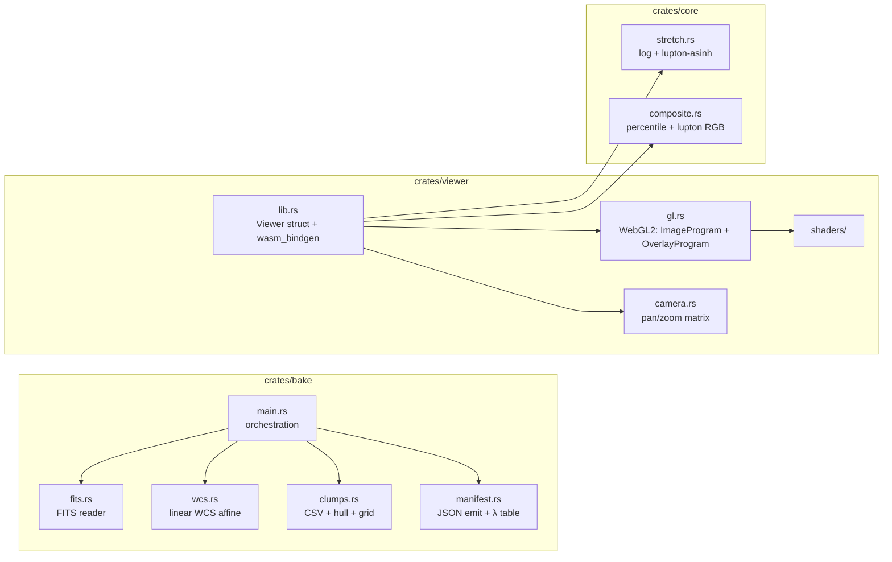

# Components

Cargo workspace. Three crates. One web shell.

## Workspace

## Module map

## Dependencies

| Crate | Deps | Notes |
|---|---|---|
| `jelly-core` | — | pure std f64 |
| `bake` | `fitrs`, `serde`, `serde_json`, `thiserror` | native only |
| `viewer` | `jelly-core`, `wasm-bindgen =0.2.100`, `web-sys`, `js-sys` | cdylib → wasm32-unknown-unknown |

`wasm-bindgen` pinned to installed CLI version — mismatch breaks runtime bindings.
