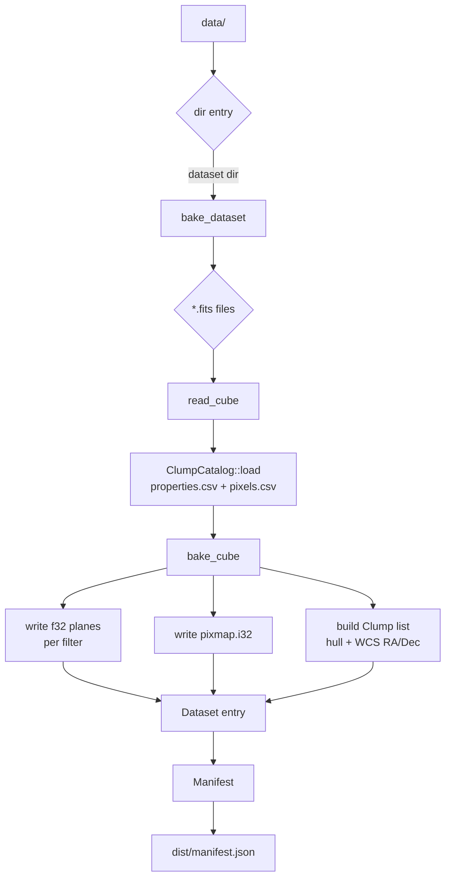
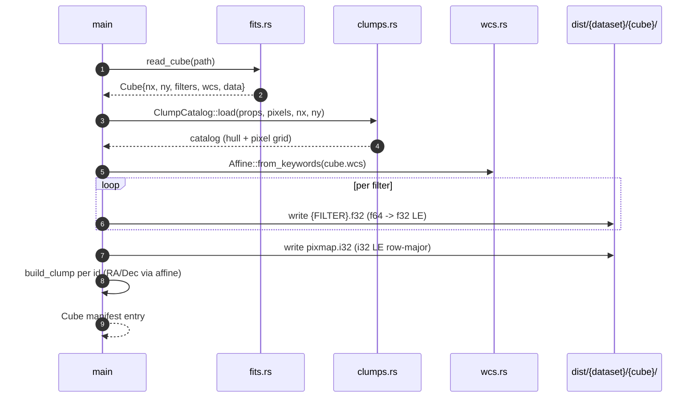

# Build pipeline (bake)

CLI entry: `bake [DATA_DIR] [DIST_DIR]`. Default `data` → `dist`.

## Directory walk



## Per-cube bake



## Outputs per cube

```
dist/{dataset}/{cube}/
├── F090W.f32      nx*ny*4 bytes, f32 LE, row-major (NaN = invalid)
├── F115W.f32
├── ...
└── pixmap.i32     nx*ny*4 bytes, i32 LE, pixel -> clump id (-1 = none)
```

Plus top-level `dist/manifest.json`.
