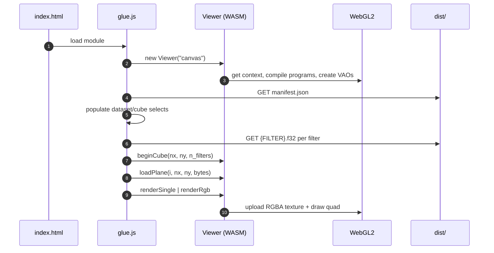
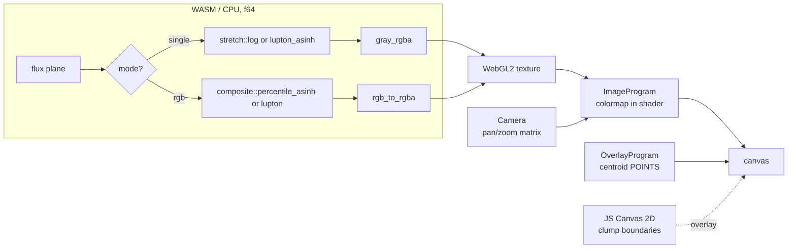
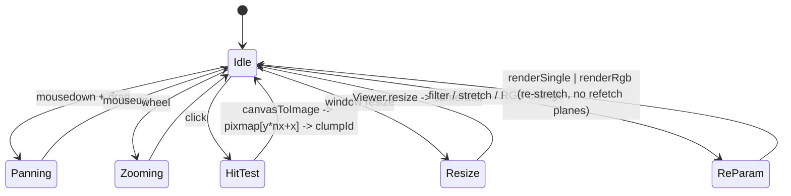

# Runtime (viewer)

JS shell loads manifest + glue.js, instantiates WASM Viewer, pushes planes, drives render.

## Boot

## Render path

## Interaction

## FFI surface (wasm_bindgen)

| JS name | Rust | Purpose |
|---|---|---|
| `new Viewer(id)` | `Viewer::new` | bind canvas, compile GL |
| `beginCube` | `begin_cube` | reset plane cache |
| `loadPlane` | `load_plane` | f32 LE → f64 plane |
| `renderSingle` | `render_single` | stretch + colormap |
| `renderRgb` | `render_rgb` | composite |
| `setCentroids` | `set_centroids` | upload POINTS |
| `setShowCentroids` | `set_show_centroids` | toggle |
| `resize` | `resize` | viewport + camera fit |
| `pan` / `zoom` | `pan` / `zoom_about` | camera |
| `canvasToImage` / `imageToCanvas` | `canvas_to_image` / `image_to_canvas` | hit-test + overlay anchor |
| `render` | `render` | redraw |
