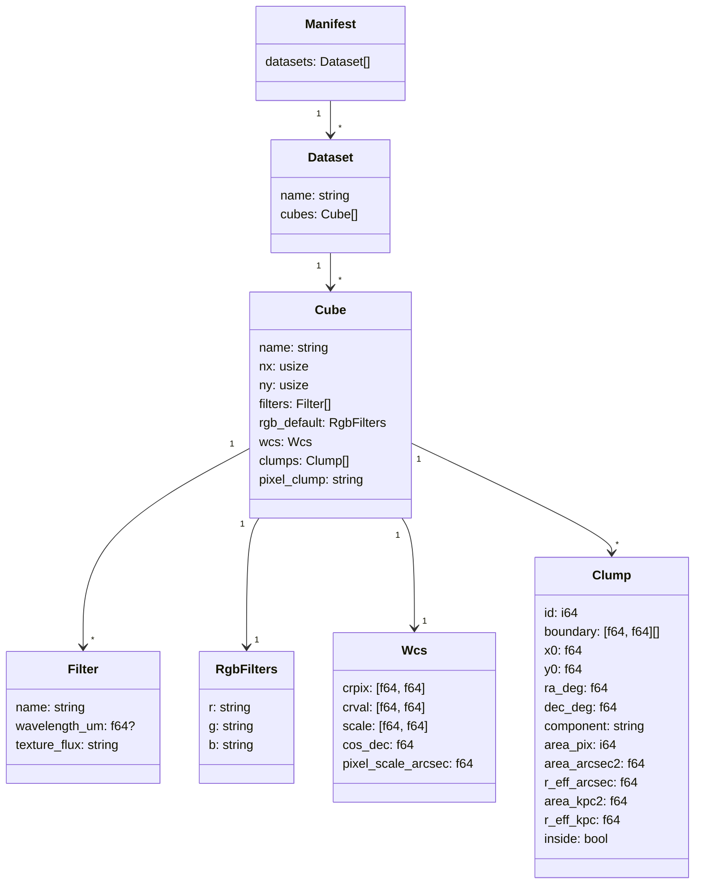
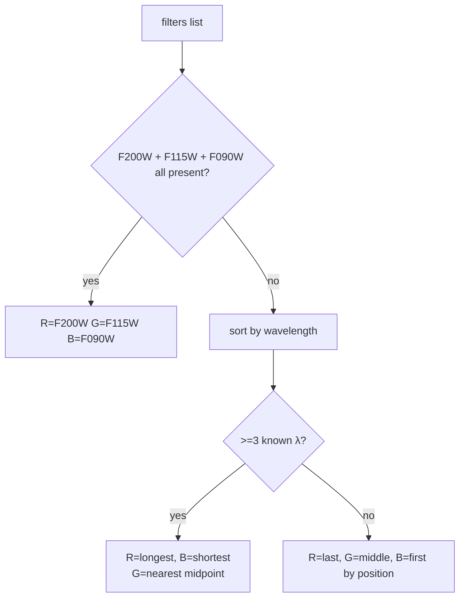

# Data model

Single contract: `manifest.json` + binary sidecar files.

## Manifest schema



## File layout

```
dist/
├── manifest.json
└── {dataset}/
    └── {cube_name}/
        ├── {FILTER}.f32    (per filter: nx*ny f32 LE, row-major, NaN = invalid)
        └── pixmap.i32      (nx*ny i32 LE, pixel -> clump id, -1 = none)
```

## Binary encodings

| File | Element | Order | Invalid |
|---|---|---|---|
| `*.f32` | f32 LE | row-major (y outer, x inner) | NaN |
| `pixmap.i32` | i32 LE | row-major | -1 |

## Default-RGB resolution



## NIRCam wavelength table (µm)

F070W 0.704, F090W 0.901, F115W 1.154, F140M 1.404, F150W 1.501, F162M 1.627,
F182M 1.845, F200W 1.990, F210M 2.093, F250M 2.503, F277W 2.786, F300M 2.996,
F335M 3.365, F356W 3.563, F360M 3.621, F410M 4.092, F430M 4.280, F444W 4.421,
F460M 4.624, F480M 4.834.
