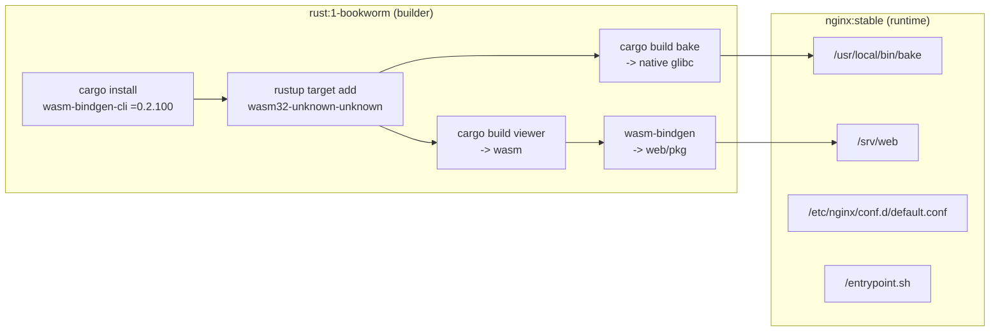
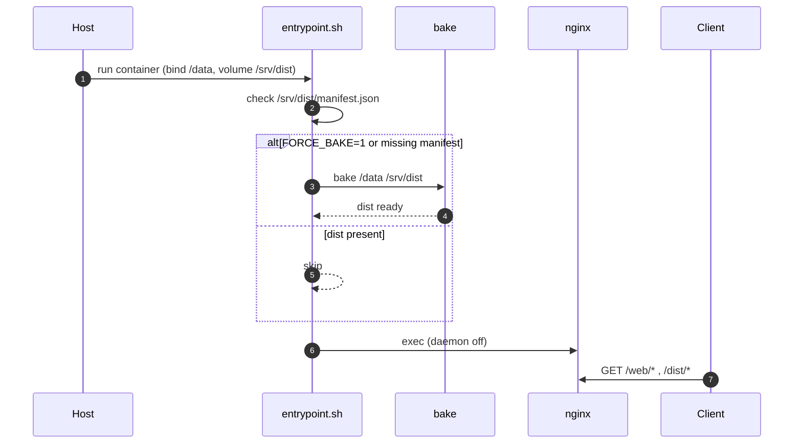
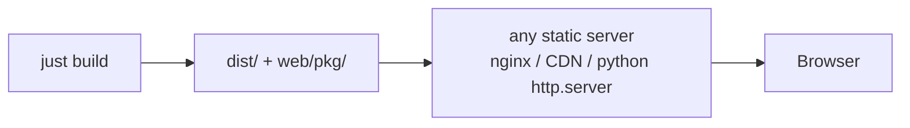

# Deployment

Container is build + serve. Bake runs once per volume (idempotent via manifest check).

## Image layers

Runtime stays Debian glibc because `bake` is glibc-linked; alpine/musl won't run it.

## Runtime sequence

## Volumes + env

| Mount / env | Role |
|---|---|
| `-v ./data:/data` | FITS + CSV datasets input |
| `-v jelly_dist:/srv/dist` | baked outputs (persistent) |
| `FORCE_BAKE=1` | re-bake even when manifest exists |

## Static hosting (no container)

## GitHub Pages data artifact

The Pages workflow downloads the release asset named exactly `dist.tar.gz`,
normalizes either a root-level archive or an archive containing a top-level
`dist/` directory, copies `web/` beside it, and publishes the combined
directory. A release upload label does not rename an asset: its actual filename
must be `dist.tar.gz`.
